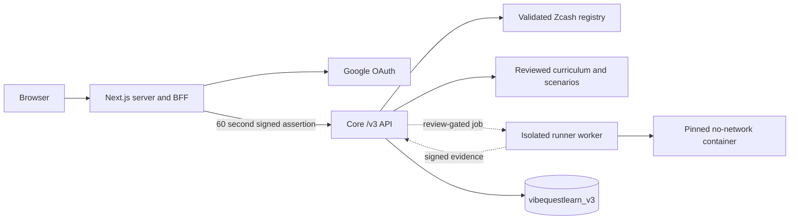

# VibeQuestLearn Product Architecture

Version: v3 identity foundation
Branch: `zcashlearn`

## Active Boundary

The browser owns no Core identity credential. Web reads its encrypted session server-side, strips browser identity headers, and mints an audience-bound assertion. Core verifies the signature and independently derives the expected opaque user ID from Google's stable provider subject.

## Route Classes

Public Core routes are limited to health, readiness, the catalog, track previews, and the reviewed curriculum projection. Protected browser calls go through Web's `/api/core` BFF. Core account routes are `/v3/me`, `/v3/me/export`, and `DELETE /v3/me`. Protected submission create, read, and cancel routes are registered but return `503 runner-review-required` while production execution is gated.

The inherited wallet-address, quest, AI, reward, and learning handlers are no longer registered in the Core router. The Web wallet connector and legacy workbench graph have been removed.

## Ownership

New records carry an opaque `user_id` plus their ecosystem, track, track version, and content version. Request bodies and path parameters never choose the authenticated owner. Persistence methods receive the owner only from Core's verified `AuthenticatedPrincipal`.

Google email and display name are mutable profile fields. Ownership is keyed by provider plus Google's stable `sub`, with a unique database index. Email changes therefore do not orphan records or link accounts.

## Catalog

Core owns catalog validation. Unknown ecosystems and tracks return `404`; registered but disabled entries return `409`. The current registry contains only `zcash/shielded-payments-safety`, in `building` state and disabled.

The track contract carries `source_manifest_version`, `runner_manifest_version`, `runner_version`, and `runner_status`. Web accepts only the pinned Chunk 05 runner contract and renders `review-required`; it does not infer availability from the track alone. Chunk 04 advances it to `zcash-sources-2026-07-21.2`, preserving the exact crate pins and Revision 0 scope from Chunk 03 while adding the official viewing-key, expiry, protocol, and privacy sources used by the curriculum.

## Curriculum

Core validates curriculum `zcash-shielded-payments-1.0.0` against scenario `shielded-checkout-scenarios-1.0.0`, its source manifest, five allowlisted defects, public and hidden cases, capstone requirements, and the bounded tutor contract. The isolated runner and signed worker protocol are implemented, but production execution remains disabled pending an external queue and deployment review. The reviewed curriculum remains publicly previewable.

Web strictly parses the public projection and renders the selectable lesson workspace. Core removes answer keys, rationales, hidden case IDs, seeded defects, required repairs, and solution code before serialization. AI explanation artifacts are optional; authoritative tests and completion never depend on them.

## Persistence

V3 data uses `MONGODB_DATABASE_V3`, defaulting to `vibequestlearn_v3`. The account export and deletion endpoints operate only on collections filtered by the principal's opaque `user_id`. Shared scenario definitions are not deleted with an account.

See `authentication.md` for key rotation, session behavior, and threat controls.
