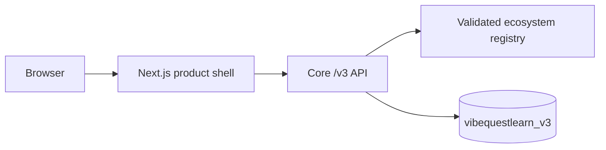

# VibeQuestLearn Product Architecture

Version: v3 foundation
Branch: `zcashlearn`

## Active Boundary

The root application is a server-rendered product shell. It loads the catalog directly from `vibequest-core` and exposes only the registered Zcash ecosystem and its single disabled build-state track.

## Contracts

All new records carry:

- `schema_version`
- opaque `user_id` where the record has an owner
- `ecosystem_id` and `track_id`
- `track_version` and `content_version`
- verifier and evidence versions where correctness is recorded

Wallet addresses, JoyID proofs, CKB status, Fiber invoices, rewards, and badges are not part of v3 contracts.

## Catalog

Core owns catalog validation. Unknown ecosystems and tracks return `404`. Registered but disabled entries return `409`. Web validates the response schema before rendering it.

The current registry contains only:

- ecosystem: `zcash`
- track: `shielded-payments-safety`
- status: `building`
- enabled: `false`

## Persistence

V3 records use the fresh `MONGODB_DATABASE_V3` namespace, defaulting to `vibequestlearn_v3`. Startup creates indexes for learning sessions, scenarios, submissions, and completion receipts. Index initialization is bounded and cannot prevent catalog startup when MongoDB is unavailable.

## Compatibility

The inherited CKB application remains buildable but is not routed from the active root. Its TypeScript API lives in `src/lib/legacy-api.ts`. Its prior architecture is preserved in `docs/legacy-ckb-product-architecture.md`.

Chunk 02 removes wallet identity and Chunk 06 removes the remaining client-authoritative workbench path.
