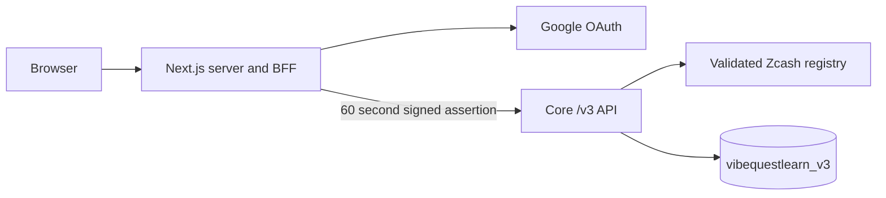

# VibeQuestLearn Product Architecture

Version: v3 identity foundation
Branch: `zcashlearn`

## Active Boundary

The browser owns no Core identity credential. Web reads its encrypted session server-side, strips browser identity headers, and mints an audience-bound assertion. Core verifies the signature and independently derives the expected opaque user ID from Google's stable provider subject.

## Route Classes

Public Core routes are limited to health, readiness, the catalog, and catalog track previews. Protected browser calls go through Web's `/api/core` BFF. Core account routes are `/v3/me`, `/v3/me/export`, and `DELETE /v3/me`.

The inherited wallet-address, quest, AI, reward, and learning handlers are no longer registered in the Core router. The Web wallet connector and legacy workbench graph have been removed.

## Ownership

New records carry an opaque `user_id` plus their ecosystem, track, track version, and content version. Request bodies and path parameters never choose the authenticated owner. Persistence methods receive the owner only from Core's verified `AuthenticatedPrincipal`.

Google email and display name are mutable profile fields. Ownership is keyed by provider plus Google's stable `sub`, with a unique database index. Email changes therefore do not orphan records or link accounts.

## Catalog

Core owns catalog validation. Unknown ecosystems and tracks return `404`; registered but disabled entries return `409`. The current registry contains only `zcash/shielded-payments-safety`, in `building` state and disabled.

## Persistence

V3 data uses `MONGODB_DATABASE_V3`, defaulting to `vibequestlearn_v3`. The account export and deletion endpoints operate only on collections filtered by the principal's opaque `user_id`. Shared scenario definitions are not deleted with an account.

See `authentication.md` for key rotation, session behavior, and threat controls.
