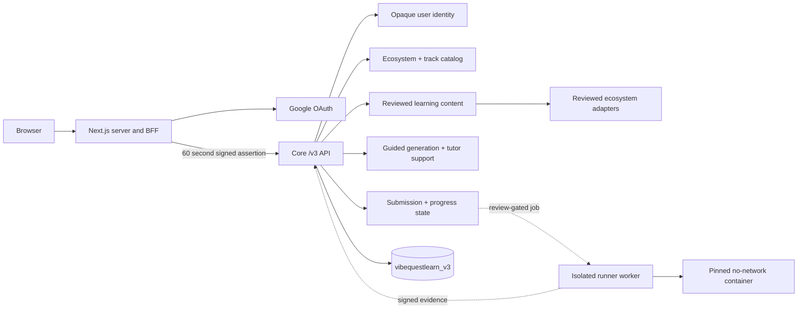

# VibeQuestLearn Product Architecture

Version: v3 ecosystem-neutral learning platform  
Branch: `zcashlearn`

## Architecture Principle

VibeQuestLearn is a multi-ecosystem AI learning platform. The platform is not tied to any single ecosystem, wallet, or reward model.

Identity, persistence, progression, curriculum projection, tutor access, submission state, and UI navigation are shared platform concerns. Ecosystem-specific knowledge belongs only in reviewed track packages and adapters.

The current grant-facing implementation is the Zcash Shielded Payments Track, but Zcash is a track, not the architecture. CKB, Fiber, Zcash, and future ecosystems must all plug into the same neutral product model.

## Active Boundary

The browser owns no Core identity credential. Web reads its encrypted session server-side, strips browser identity headers, and mints an audience-bound assertion. Core verifies the signature and independently derives the expected opaque user ID from Google's stable provider subject.

## Neutral Platform Contract

The platform contract is intentionally ecosystem-neutral:

| Platform Area | Neutral Rule |
| --- | --- |
| Identity | Google-backed account identity; no wallet address as owner |
| Ownership | Opaque `user_id` assigned by Core, never by request body or path |
| Catalog | Ecosystems and tracks are data records, not hardcoded platform branches |
| Curriculum | Lessons, submodules, checkpoints, and resources follow one shared shape |
| Tutor | Tutor answers are lesson-bound and non-authoritative |
| Code mode | Code examples are track artifacts, not global app behavior |
| Runner | Execution is optional, reviewed, versioned, and track-scoped |
| Completion | Completion depends on platform evidence, not ecosystem-specific claims |
| UI copy | Generic surfaces use learner/course/module/checkpoint/quest language |

Ecosystem names may appear in track cards, lessons, source references, adapter names, and scenario documentation. They should not define account identity, global navigation, persistence ownership, or shared page structure.

## Route Classes

Public Core routes are limited to health, readiness, catalog, track previews, and reviewed curriculum projections. Protected browser calls go through Web's `/api/core` BFF. Core account routes are `/v3/me`, `/v3/me/export`, and `DELETE /v3/me`.

Protected submission create, read, and cancel routes are registered behind the same identity boundary. If a track has no reviewed runner enabled, Core fails closed with a review-required response instead of exposing an incomplete execution path.

Legacy wallet-address, reward, payout, and client-authoritative handlers are not part of the v3 platform contract.

## Ownership

New records carry an opaque `user_id` plus `ecosystem_id`, `track_id`, `track_version`, and `content_version`. Request bodies and path parameters never choose the authenticated owner. Persistence methods receive the owner only from Core's verified `AuthenticatedPrincipal`.

Google email and display name are mutable profile fields. Ownership is keyed by provider plus Google's stable `sub`, with a unique database index. Email changes therefore do not orphan records or link accounts.

## Catalog And Track Packages

Core owns catalog validation. Unknown ecosystems and tracks return `404`; registered but disabled entries return a clear unavailable/review-required response.

A track package carries:

- ecosystem ID;
- track ID;
- content version;
- source manifest version;
- optional runner manifest version;
- optional runner version;
- runner status;
- curriculum projection contract;
- completion policy.

The current reviewed package is Zcash shielded payments. Future CKB, Fiber, or other ecosystem packages must satisfy the same contract rather than adding custom global behavior.

## Curriculum

Curriculum is projected through a shared shape: modules, submodules, lesson body, checkpoint prompt, related resources, code lenses where useful, tutor contract, and optional quest/scenario bridge.

Core removes answer keys, hidden case IDs, seeded defects, required repairs, and solution code before serialization. AI explanation artifacts are optional; authoritative tests and completion never depend on AI output.

A track can use ecosystem-specific sources, but the UI receives them as structured lesson resources. The page layout remains the same across ecosystems.

## Runner And Evidence Boundary

Runner execution is optional per track. A reviewed runner must be isolated, versioned, no-network unless explicitly approved, and bound to scenario/source/test/protocol versions.

Completion evidence must be reproducible and server-owned. Browser booleans, frontend state, wallet signatures, invoices, or protocol-specific claims cannot complete a lesson or quest by themselves.

## Persistence

V3 data uses `MONGODB_DATABASE_V3`, defaulting to `vibequestlearn_v3`. Account export and deletion endpoints operate only on collections filtered by the principal's opaque `user_id`. Shared ecosystem catalogs, track packages, and scenario definitions are not deleted with an account.

## Product Surfaces

| Surface | Neutral Role |
| --- | --- |
| Landing | Explains VibeQuest as a multi-ecosystem learning workbench |
| Learn | Lets learners select ecosystem, track, topic, profile, pace, and code preference |
| Dashboard | Shows active courses, progress, streaks, resume/new-course options, and recent learning activity |
| Lesson Workspace | Renders modules, submodules, lesson content, resources, checkpoint, tutor, and navigation |
| Workbench | Shows code examples, scenario files, checks, denial cases, and quest evidence when a track supports them |
| Completion | Records learner progress and quest completion through Core-owned evidence |

## Design And Docs Rule

Main product docs and designs must describe platform behavior in ecosystem-neutral terms. Use specific ecosystem language only where the user has selected a track or where a track/scenario document requires it.

Avoid platform framing that makes one ecosystem, wallet, invoice, reward path, or protocol proof own the product loop.

Use platform framing that keeps VibeQuest as a multi-ecosystem learning workbench, keeps Google-backed account identity responsible for learner progress, and treats track-specific adapters as protocol context plus optional execution evidence.

See `authentication.md` for key rotation, session behavior, and threat controls.
